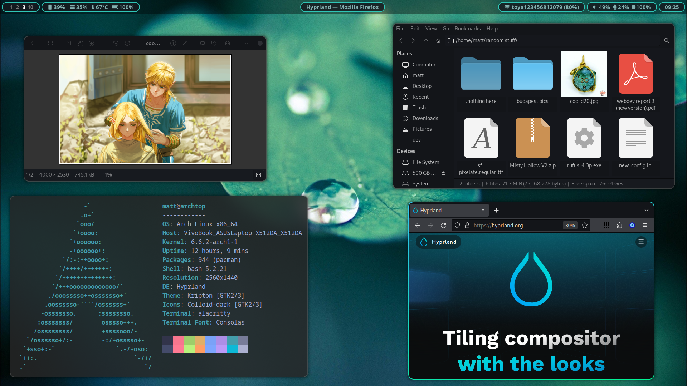

# HyprArch Install Script




## Overview

This script will interactively install a fully configured Arch desktop environment based on the Hyprland compositor complete with software for the everyday user's every need. Thanks to the configuration file, it is possible to automatically install additional bundles like steam and integration of windows apps.

> **note**: The script is targeted at the arch linux distribution only and I don't grant everything will work on any other distribution.

> **very important note**: HyprArch is in early stages of development and its configuration isn't complete yet. Missing parts include Qt and waybar configs.


## Default Stack

| __Main Components__ |          |
| ------------------- | -------: |
| Login Screen        | Sddm     |
| Compositor          | Hyprland |
| Status Bar          | Waybar   |
| Notifications       | Dunst    |
| Wallpapers          | Swww     |
| Shell               | Bash     |

| __I/O__          |                   |
| ---------------- | ----------------: |
| Graphical Server | Wayland           |
| Sound Server     | Pipewire          |
| Bluetooth        | Bluetooth Manager |

| __User Software__  |            |
| ------------------ | ---------: |
| Launcher           | Wofi       |
| Terminal           | Alacritty  |
| File Explorer      | Thunar     |
| Browser            | Firefox    |
| Image Viewer       | gThumb     |
| Video Player       | VLC        |
| Archive Manager    | Ark        |

| __Additional Software__  |              |
| ------------------------ | -----------: |
| Game Launcher            | Steam        |
| Note-taking App          | Joplin       |
| Flashcards               | Anki         |
| Office Suite             | Libre Office |
| Windows App Emulation    | Wine         |


## Features

* Configurable through the config.ini file.
* Support for laptop features like battery, brightness and touchpad toggle.
* Graphical Bluetooth and Wifi support.
* Fully configured file manager with plugins.
* Custom GTK theme, icons and cursor.
* Organized scripting system with state that persists after shutdown.
* Toggleable 'Gaming Mode' which disables blur, borders and animations so you can squeeze more performance.


## Configuration

The script uses a configuration file in the .ini format. Inside you can specify which bundles of software will be installed (i.e. thunar or dolphin and whether to install steam) and configure more sophisticated options like laptop features. In the final section you can append your own software to install.


## Installing

Firstly ensure that you have access to the internet and have git installed.
```
sudo pacman -S git
```

To get started, clone the repo and launch the script:
```bash
git clone https://github.com/mat-kubiak/hyprarch.git
cd hyprarch && bash install.sh
```

> **note**: if you want to see what the script will do without installing anything, use the `-d` flag for debug. Note that any changes you make in the config file will persist.

Before the installation, the script will prompt you to open the .ini configuration file. This is not necessary, but recommended.

If anything goes wrong, you can find a log file in the cloned directory.


## Arch Beginner's Tutorial

You **shouldn't** be using arch if you have just started using linux, however if you still want to try it out, here's a short tutorial to make it as beginner friendly and as smooth as possible.

**1.** Download the arch iso file from [here](https://archlinux.org/download/) and create a usb bootable media. You can check the file's hash using the command:

``` bash
sha256sum <path-to-iso>
```

The output of this command should be an exact match to the hash found in `Checksums > SHA256` on the download site.

**3.** after the iso successfully loads, ensure that you have internet with the `ping` command.

``` bash
ping google.com
```

**3.5.** If you have a laptop without an ethernet port, use the `iwctl` utility to connect wirelessly:

```
iwctl
[iwd]# device list
[iwd]# station <your-device> scan
[iwd]# station <your-device> get-networks
[iwd]# station <your-device> connect <network-SSID>
[iwd]# exit
```

**4.** enter the `archinstall` command. It will open a tui installer for arch. Apart from the personal choices, use the `profile > minimal` and `network > use Network Manager` options. You can ommit the audio server, as the script will install it later for you.

**5.** After installing the system and rebooting, refer to the [Install Section](#install).


## After Installation

There are a few things you might want to do after the installation:

* Install your own wallpapers by putting them in `/usr/share/wallpapers`. You can set the current wallpaper in `$HOME/.config/hypr/status.ini` and the default one in `$HOME/.config/hypr/scripts/defaults.ini`.
* In order for the touchpad toggle script to work, put the appropriate touchpad device name in the `_touchpad_device` variable in `$HOME/.config/hypr/scripts/touchpad.sh` script. You can get the name using the `hyprctl devices` command.
* Set your own additional window rules in `$HOME/.config/hypr/hyprland.conf` according to the [Hyprland Wiki](https://wiki.hyprland.org). You can list classes of all currently opened windows by using the `hyprctl clients` command.
* Change the GTK style (if you don't like the default one) using the already installed `nwg-look` utility. GTK themes should go in the `$HOME/.themes` directory and cursors and icon themes should go in `$HOME/.icons` directory.


## Useful Resources

I appended some useful resources here in case someone wants to further configure the environment or discover new software for wayland.

* [Arch Wiki](https://wiki.archlinux.org/) is a site you probably know. It's the most important wikipedia for an arch user. Easily the best resource available for arch.
* [Hyprland Wiki](https://wiki.hyprland.org) has almost everything you'll need to configure hyprland, along with amazing software recommendations.
* [Are We Wayland Yet?](https://arewewaylandyet.com) presents Wayland-compatible software for every desktop need.
* [Arch Linux User Repository](https://aur.archlinux.org/) is a universally known software repository across the arch community. You can use yay to install software from it.
* [Pling Store](https://www.pling.com/) is the most popular internet place for acquiring themes for GTK, QT, GNOME, Plasma, Sddm and others.
* [Nerd Fonts](https://www.nerdfonts.com/) is an open-source haven for fonts with emojis already patched.
* [EmojiGraph](https://emojigraph.org) is a complete wikipedia of copy-and-paste emojis in different styles and versions.